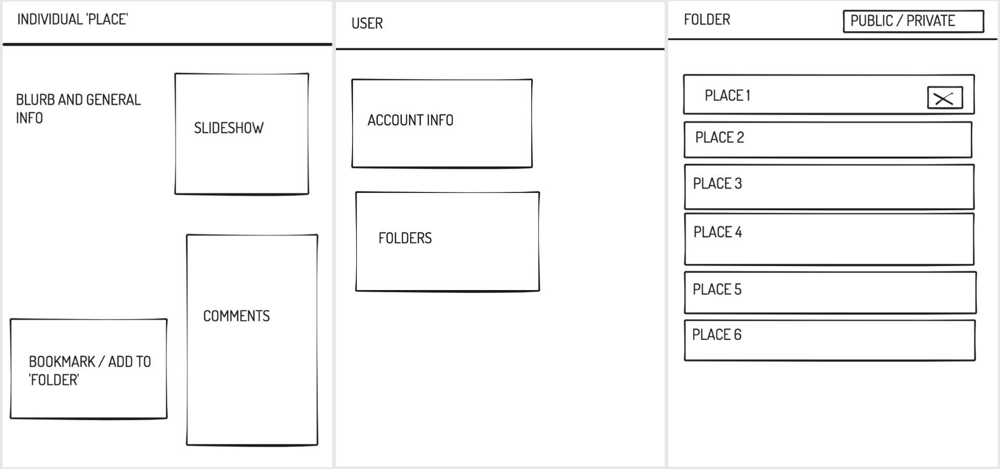

##  General Assembly, Software Engineering Immersive


# Project #4: Travel Explorer


## Overview 

The final project at GA was to create a full-stack web application. This two-person, week-long project utilised a Python Flask RESTful API.
TravelExplorer allows users to navigate the world, exploring new cities and find some new places and even suggest an itinerary for specified dates. User functionality allows the creation of travel wish-lists, and comments and reviews.
The idea was born out of a mutual love for travel and frustration with the lack of user interaction with travel websites, specifically as a place to plan a trip! 
You can find the project here.


## Technologies

* React
* Python
* Flask
* CSS
* Bulma
* npm
* Git and GitHub
* Ziteboard
* Libraries
* Moment.js
* Marshmallow
* PostgreSQL
* SQLAlchemy
* Insominia
* TablePlus
* APIs
	- Triposo
	- Open Cage


## Brief

### Requirements

​* **Build a full-stack application** by making your own backend and your own front-end
* **Use a Python Flask API** using a Flask REST Framework to serve your data from a Postgres database
* **Consume your API with a separate front-end** built with React
* **Be a complete product** which most likely means multiple relationships and CRUD functionality for at least a couple of models
* **Implement thoughtful user stories/wireframes** that are significant enough to help you know which features are core MVP and which you can cut
* **Have a visually impressive design** to kick your portfolio up a notch and have something to wow future clients & employers. **ALLOW** time for this.
* **Be deployed online** so it's publicly accessible.
* **A working app** hosted on the internet
* **A link to your hosted working app** in the URL section of your Github repo
* **A git repository hosted on Github**, with a link to your hosted project, and frequent commits dating back to the _very beginning_ of the project


### Suggested Enhancements


## Approach

### Wireframes

We used a mixture of ziteboard and googledocs to outline what we wanted to achieve. A combination of blueprints and to-do lists:




### FrontEnd?
### BackEnd?

### Folders
We wanted to create a folder system whereby users could explore existing (public) folders or create their own in order to organise and plan future trips. We went about this by creating seperate SQL tables for 'Places' and for 'Folders' and a reference table to join the two. 

```
places_folder_join = db.Table('places_folder',

  db.Column('folder_id', db.Integer, db.ForeignKey('folders.id'), primary_key=True),
  db.Column('place_id', db.Integer, db.ForeignKey('places.id'), primary_key=True)
  )
```

We also did this with 'Users' and 'Folders' in order to link the two. 

```
users_folder_join = db.Table('users_folder',

  db.Column('folder_id', db.Integer, db.ForeignKey('folders.id'), primary_key=True),
  db.Column('user_id', db.Integer, db.ForeignKey('users.id'), primary_key=True)
  )
```

We wanted the folders to be as interactive as possible and allow users to add ad remove both places from folders as well as the folders themselves, change the name of the folders etc. For this we had to create routes both for 'Places' within the folders and for the folders themselves.

```
# * Create folder ------------
@router.route('/folders', methods=['POST'])
@secure_route
def create_folder():
  folder_data = request.get_json()
  user = g.current_user
  user_folder = g.current_user.folder
  folder = folder_schema.load(folder_data)
  user_folder.append(folder)
  user.save()
  folder.save()
  return folder_schema.jsonify(folder), 200


# * Get folder ------------
@router.route('/folders/<int:id>', methods=['GET'])
def get_folder(id):
  folder = Folder.query.get(id)

  if not folder:
    return { 'message': 'Folder not available' }, 404

  return populate_folder.jsonify(folder), 200


# * Get all folders ------------
@router.route('/folders', methods=['GET'])
def get_folders():
  folders = Folder.query.all()

  return populate_folder.jsonify(folders, many=True), 200


# * Put Folder ------------
@router.route('/folders/<int:id>', methods=['PUT'])
@secure_route
def put_folder(id):
  existing_folder = Folder.query.get(id)

  if not existing_folder:
    return { 'message': 'Folder not available' }, 404

  try:
    folder = folder_schema.load(
      request.get_json(),
      instance = existing_folder,
      partial = True
    )

  except ValidationError as e:
    return { 'errors': e.messages, 'message': 'Something went wrong' }

  folder.save()
  return populate_folder.jsonify(folder), 201


# * Delete folder ------------
@router.route('/folders/<int:id>', methods=['DELETE'])
@secure_route
def delete_folder(id):
  folder = Folder.query.get(id)

  if not folder:
    return { 'message': 'Folder not available' }, 404

  folder.remove()
  return { 'message': f'Folder {id} successfully deleted' }


# * Delete place from folder ------------
@router.route('/folders/<int:folder_id>/<int:place_id>', methods=['DELETE'])
@secure_route
def delete_place_from_folder(folder_id, place_id):
  folder = Folder.query.get(folder_id)
  new_folder = [place for place in folder.places if place.id != place_id]
  folder.places = new_folder
  folder.save()
  place = Place.query.get(place_id)
  return populate_place.jsonify(place), 200
  

# * Add place to folder ------------
@router.route('/folders/<int:folder_id>/<int:place_id>', methods=['POST'])
def add_place_to_folder(folder_id, place_id):
  place = Place.query.get(place_id)
  folder = Folder.query.get(folder_id)
  id_list = []
  new_folder = []
  for x in folder.places:
      id_list.append(x.id)
      print(id_list)
  if place_id in id_list:
    print('already in folder')
    new_folder = folder.places
  else:
    print('not in folder')
    new_folder = folder.places + [place]

  print(new_folder)
  folder.places = new_folder  
  folder.save()
  
  return populate_place.jsonify(place)
```

### Comments

We wanted users to be able to comment on their experiences of 'Places' they had visted or hoped to visit. As we didnt want un-signed-in users to be able to do this we implemented a @secure_route:

```
def secure_route(func):
  @wraps(func)
  def wrapper(*args, **kwargs):
    raw_token = request.headers['Authorization']
    clean_token = raw_token.replace('Bearer ', '')

    try:
      payload = jwt.decode(clean_token, secret)
      user_id = payload['sub']
      user = User.query.get(user_id)
      
      if not user:
        return { 'message': 'Unauthorized' }, 401

      g.current_user = user

    except jwt.ExpiredSignatureError:
      return { 'message': 'Token has expired' }, 401
    
    except Exception as e:
        return e, 401
        
    return func(*args, **kwargs)

  return wrapper
```

Along with comments we wanted users to be able to rate places. For this we used the ReactRatingStarsComponent library.

```
{comment.rating !== 0 && <ReactStars value={(comment.rating) / 2} count={5} size={16} activeColor="#ffd700" edit={false} isHalf={true} />}
```

## Screenshots


 
 
 


## Challenges / Victories


### Creating & Adding to Folders 

A feature we really wanted to include was to be able to create a folder in order to add a place to it in a single step. Rather than writing a new route in the backend we linked the two existing routes with a .then in the frontend and then re-rendered the page with the updated information which allows the new folder to be displayed as soon as it has been created.

Backend:

```
# * Create folder ------------

@router.route('/folders', methods=['POST'])
@secure_route
def create_folder():
  folder_data = request.get_json()
  user = g.current_user
  user_folder = g.current_user.folder
  folder = folder_schema.load(folder_data)
  user_folder.append(folder)
  user.save()
  folder.save()
  return folder_schema.jsonify(folder), 200
  
  
# * Add place to folder ------------

@router.route('/folders/<int:folder_id>/<int:place_id>', methods=['POST'])
def add_place_to_folder(folder_id, place_id):
  place = Place.query.get(place_id)
  folder = Folder.query.get(folder_id)
  id_list = []
  new_folder = []
  for x in folder.places:
      id_list.append(x.id)
  if place_id in id_list:
    print('already in folder')
    new_folder = folder.places
  else:
    print('not in folder')
    new_folder = folder.places + [place]

  folder.places = new_folder  
  folder.save()
  
  return populate_place.jsonify(place)
```

Frontend:

```
  function createAndAddToFolder(name) {
    openCreateAndAddModal()
    updateAddRemoveName(name)
    axios.post('/api/folders', { 'name': name, 'public': toggle }, {
      headers: { Authorization: `Bearer ${token}` }
    })
      .then(resp => {
        axios.post(`/api/folders/${resp.data.id}/${singlePlace.id}`, {
          headers: { Authorization: `Bearer ${token}` }
        })
          .then(resp => {
            updateSinglePlace(resp.data)
            updateCurrentFolders(resp.data.folder.map(folder => {
              return folder
            }))
          })
      })
  }
```

### Password Confirmation

This is something that we would have liked to have spent more time on as it is by no means perfect code for what we wanted to achieve. In order to get the confirmation to work, we had to save the 'passwordConfirmation' in the DB...not something that should really be in there, so we ended up hashing the confirmation as well as the password so as not to leave it visible - but this is now redundant as it is only used when registering so there is no need to save it anyway. As I say, it would have been nice to spend more time on this and clean it up, despite it currently working.

```
class User(db.Model, BaseModel):

  __tablename__ = 'users'

  username = db.Column(db.String(15), nullable=False, unique=True)
  email = db.Column(db.String(128), nullable=False, unique=True)
  password_hash = db.Column(db.String(128), nullable=False)
  passwordConfirmation_hash = db.Column(db.String(128), nullable=False)
  folder = db.relationship('Folder', secondary=users_folder_join, backref='users')


  @hybrid_property
  def password(self):
    pass


  @password.setter
  def password(self, password_plaintext):
    self.password_hash = bcrypt.generate_password_hash(password_plaintext).decode('utf-8')

  def validate_password(self, password_plaintext):
    return bcrypt.check_password_hash(self.password_hash, password_plaintext)


  def generate_token(self):
    payload = {
      'exp': datetime.utcnow() + timedelta(days=1),
      'iat': datetime.utcnow(),
      'sub': self.id
    }

    token = jwt.encode(
      payload,
      secret,
      'HS256'
    ).decode('utf-8')

    return token

  @hybrid_property
  def passwordConfirmation(self):
    pass

  @passwordConfirmation.setter
  def passwordConfirmation(self, passwordConfirmation_plaintext):
    self.passwordConfirmation_hash = bcrypt.generate_password_hash(passwordConfirmation_plaintext).decode('utf-8')

  def validate_passwordConfirmation(self, passwordConfirmation_plaintext):
    return bcrypt.check_passwordConfirmation_hash(self.passwordConfirmation_hash, passwordConfirmation_plaintext)
```

 


## Known bugs

* ***Trip Planner Colours*** - This is an issue we encountered with deployment. Locally the inputs look as we want them to look - however once deployed, they have changed colour.


* ***React Stars*** - When someone posts a rating (with or without a comment) the starts don't reset back to 0. The comment text resets to empty, but we couldnt get the rating to do the same.

 

## Potential future features

* ***Posting & Putting Places*** - We decided not to include it at the time but it would be nice for users to be able to add places that are currently not in the database.
* ***Ability to organise folders*** - With the time constrainst imposed we were unable to implement this feature. However with a bit more time we would have liked to have given users the option to organise and customise their folders. Eg. by day of trip / preference of activity etc 

## Images

* Background image by [Rana Sawalha on Unsplash] (https://unsplash.com/@ranasawalha)

* Background image by [Dariusz Sankowski
on Unsplash] (https://unsplash.com/@dariuszsankowski)

* Background image by [Kira auf der Heide on Unsplash] (https://unsplash.com/@kadh)

* Background image by [L B on Unsplash] (https://unsplash.com/@iliketobike)

* Background image by [Cynthia del Río
on Unsplash] (https://unsplash.com/@luthiabags)


